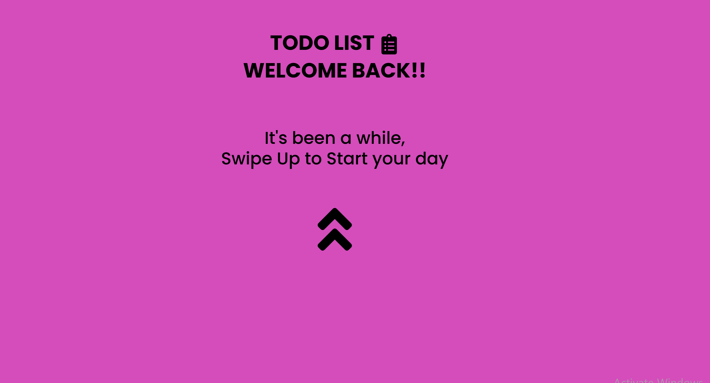

# TODO LIST APP
---
- This is a simple to-do application built using React + Vite, and Tailwind CSS. The app allows users to add, delete, edit and mark tasks as completed.

## Features
---
- Add new tasks
- Delete existing tasks
- Mark tasks as completed
- Responsive design

## Demo
- You can view a live demo of the app here: https://lucia-todoapp-reactjs.netlify.app/

## Installation
---
1. Clone the repository:
 `https://github.com/NambiLucia/TodoApp-ReactJS.git`
 `cd simple-todo-app`

 2. Install dependencies:
 `npm install`

 3. Start the development server:
`Start the development server:`

## Usage
---
- Add a task: Type the task description in the input field and click the "Add Task" icon.
- Delete a task: Click the delete icon next to the task you want to delete.
- Edit a task: Click the edit icon next to the task you want to edit. The task will appear in the input for you to make any changes then click the add icon to add and save changes made.
- Mark a task as completed: Click the checkmark next to the task to mark it as completed.

## Contributing
---
Contributions are welcome! Please follow these steps:

1. Fork the repository.

2. Create a new branch:
`git checkout -b feature/your-feature-name`
3. Make your changes.

4. Commit your changes:
`git commit -m 'Add some feature'`
5. Push to the branch:
`git push origin feature/your-feature-name`
6. Open a pull request.